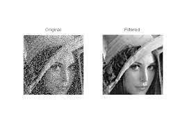
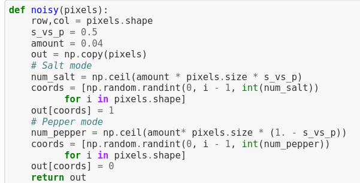
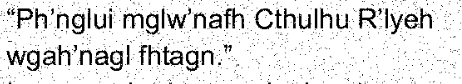
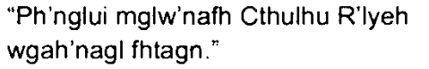
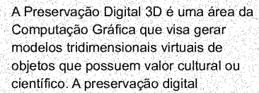
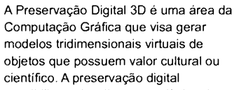
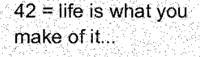
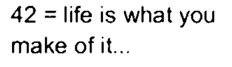
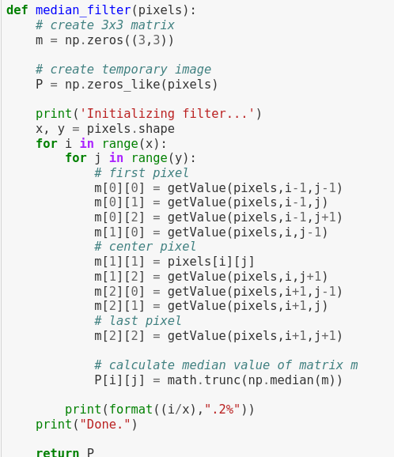
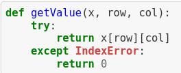

## UFS -  UNIVERSIDADE FEDERAL DE SERGIPE

#### CCET - CENTRO DE CIÊNCIAS EXATAS E TECNOLOGIA

#### DCOMP - DEPARTAMENTO DE COMPUTAÇÃO


-----------------------------

## Disciplina: Processamento de Imagens
## Professora: Beatriz Trinchão Andrade
## Alunos: Jocelino Alves Pereira Neto e Lucas Brabec Barreto Santana


### 1. Introdução

Imagens PBM, ou Portable BitMap, são imagens que possuem cada pixel sendo atribuido por 1 que corresponde à cor preta e 0 que corresponde com a cor branca.

Este formato de imagem necessita de um cabeçalho, contendo o **identificador** do tipo de imagem, que neste caso é o *P1*, em seguida as dimensões do arquivo, sendo a largura e altura. É importante lembrar que dentre os outros formatos estudados este não precisa utilizar o valor máximo do pixel, pois é possível apenas utilizar *0* ou *1*.


### 2. Definição do Problema

Nesta primeira etapa do projeto devemos ler uma imagem no formato PBM, realizar a remoção de ruídos como o do tipo Sal e Pimenta que deverá ser removido utilizando o ***filtro de mediana*** e também realizar a melhora do contraste utilizando ***histograma***.


Um ruído do tipo Sal e Pimenta é aquele onde existem impurezas em determinado intervalo da imagem, perceba que onde deveria haver um pixel preto está um pixel branco (sal) e onde deveria estar um pixel branco está com pixel preto (pimenta). Este ruído é resolvido utilizando o filtro de mediana.





Outro problema que lidamos nesta etapa do projeto foi adicionar os ruídos às imagens. Mesmo seguindo o passo-a-passo dado em sala de aula os arquivos tiveram problemas em converter do Arquivo de Documento Portátil (PDF) para as imagens PBM via GIMP.
Então, para a resolução deste problema paralelo ao projeto foi realizado o fluxo de converter os textos, sem ruído, que estavam em formato PDF (já convertidos de Documento, a partir do [Google Docs](https://docs.google.com)) utilizando o site [Convertio](https://convertio.co/pdf-pbm/). Assim, após transformar o arquivo PDF em PBM, abrimos o arquivo pelo GIMP e transformamos o tipo de dados de RAW para ASCII. Até este ponto as imagens ainda não possuiam os ruídos, então utilizando a função ```noisy``` foi adicionado os ruídos nas imagens que em outro momento será aplicado o filtro de mediana para então removê-los.




> Função que adiciona ruído de Sal e Pumenta


### 3. Projeto e implementação da solução

Utilizando a filtragem espacial não linear **filtro da Mediana**, onde condicionamos o valor de um pixel a partir da vizinhaça dele conseguimos remover os ruídos de Sal e Pimenta, onde aqui chamaremos de S&P.

A implementação de solução para este ruído é seguindo o seguinte modelo:
Primeiro é selecionado uma região 3x3 da imagem, logo em seguida essa região é ordenada e o valor central da mediana é aplicado naquele pixel.


Exemplificando, considere a região baseada em um nível de 256 cores, que podemos representar de 0..255

|     |     |     |
| --  | --- | --- |
| 42  |  3  | 147 |
| 0   | 210 | 211 |
| 40  | 23  | 94  |

Como podemos ver essa região não é bem definida.

Assim, para aplicar o filtro, será representada como um vetor [42, 3, 147, 0, 210, 211, 40, 23, 94], onde a posição inicial é o indíce 0 com valor 42, esse vetor será ordenado, resultando no vetor [0, 3, 23, 40, 42, 94, 147, 210, 211] e escolhendo a mediana, que é o valor 42. Esse processo se repetirá enquanto houver região ainda não alterada, então teremos as seguintes substituições:

| Indíce | Valor inicial | Valor final | 
| ------ | ------------- | ----------- |
|    1   |       3       |      42     |
|    2   |       147     |      23     |
|    3   |       0       |      42     |
|    4   |       210     |      42     |
|    5   |       211     |      23     |
|    6   |       40      |      23     |
|    7   |       23      |      23     |
|    8   |       94      |      0      |

Assim, após todas as aplicações do filtro da mediana obteremos o mapa de pixels:

|     |     |     |
| --  | --- | --- |
| 42  | 42  |  23 |
| 42  | 42  |  23 |
| 23  | 23  |   0 |


Após conseguir o mapa de pixel, salvamos o resultado em outro arquivo contendo o nome do grupo e a quantidade de linhas e palavras, que foram contadas manualmente.

### 4. Resultados Obtidos

Após aplicar os filtros de mediana, obtivemos os seguintes resultados:

| Imagem com ruído | Imagem após filtro aplicado |
| ---------------- | --------------------------- |
|  |  |
|      |      |
|       |     |


Nas imagens da esquerda foi aplicado o ruído de S&P com peso 0.5, já do lado direito a imagem filtrada.

### 5. Conclusão

Após aplicar o filtro de S&P (trecho abaixo) é percepctível a diferença na identificação das palavras do texto.




É importante também destacar que, para lidar com a vizinhaça fora das bordas foi utilizado o *helper* ```getValue``, que, em caso de estar fora dos limites da imagem considera que os valores extrapolados será o valor 0.




> Helper que irá adicionar 0 para posições fora dos limites da imagem
>
> Exemplificando: Considerando a posição do extremo superior esquerdo, os valores de pixel na imagem seriam os valores ```[ None, None, None, None, 0, 1, None, 2, 3 ]```, tendo os valores atribuídos como `None` estando fora dos limites da imagem e os valores númericos sendo a posição do pixel lendo-se como um vetor, como na tabela abaixo.

|       |       |       |
| ----  | ----- | ----- |
| None  | None  |  None |
| None  |   0   |    1  |
| None  |   2   |    3  |


Após aplicada na função *helper* ```getValue``` os valores da lista passariam a ser limitado e passariam a ser lidos como ```[ 0, 0, 0, 0, 0, 1, 0, 2, 3 ]```.

