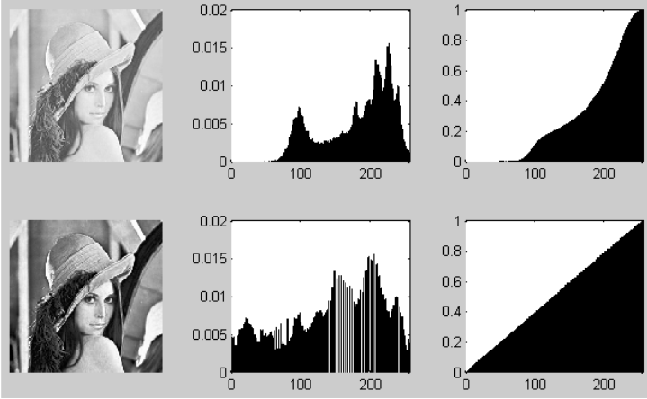

## UFS -  UNIVERSIDADE FEDERAL DE SERGIPE

#### CCET - CENTRO DE CIÊNCIAS EXATAS E TECNOLOGIA

#### DCOMP - DEPARTAMENTO DE COMPUTAÇÃO

-----------------------------

## Disciplina: Processamento de Imagens
## Professora: Beatriz Trinchão Andrade

### 1. Introdução

Imagens PBM, ou Portable BitMap, são imagens que possuem cada pixel sendo atribuido por 0 que corresponde à cor preta e 1 que corresponde com a cor branca.

Este formato de imagem necessita de um cabeçalho, contendo o **identificador** do tipo de imagem, quen este caso é o *P1*, em seguida as dimensões do arquivo, sendo a largura e altura. É importante lembrar que dentr os outros formatos estudados este não precisa utilizar o valor máximo do pixel, pois é possível apenas utilizar *0* ou *1*.

### 1. Definição do Problema

Nesta primeira etapa do projeto devemos ler uma imagem no formato PBM, realizar a remoção de ruídos como o do tipo Sal e Pimenta que deverá ser removido utilizando o ***filtro de mediana*** e também realizar a melhora do contraste utilizando ***histograma***.

Um ruído do tipo Sal e Pimenta o aquele onde existem impurezas em determinado intervalo da imagem, perceba que onde deveria haver um pixel preto está um pixel branco (sal) e onde deveria estar um pixel branco está com pixel preto (pimenta). Este ruído é resolvido utilizando o filtro de mediana.

Outro problema que poderemos resolver será o caso de haver um trecho de caracteres que está com o pouco contraste, utilizando histograma será possível identificar a frequência de pixel nas regiões e conseguir distribuir os níveis de cores na imagem.

### 1. Projeto e implementação da solução

### 1. Resultados Obtidos

### 1. Conclusão

