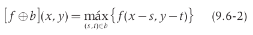
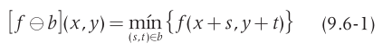
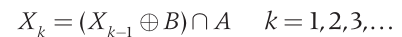
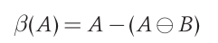

## UFS -  UNIVERSIDADE FEDERAL DE SERGIPE

#### CCET - CENTRO DE CIÊNCIAS EXATAS E TECNOLOGIA

#### DCOMP - DEPARTAMENTO DE COMPUTAÇÃO

-----------------------------

## Disciplina: Processamento de Imagens
## Professora: Beatriz Trinchão Andrade
## Alunos: Jocelino Alves Pereira Neto e Lucas Brabec Barreto Santana

### 1. Introdução

Para entender melhor o problema, daremos uma breve introdução do que é OCR, ou **Optical Character Recognition** (Reconhecimento Óptico de Caracteres) é uma ferramenta que auxilia na verificação e identificação de dados em documentos. Em outras palavras, é o processo que lê uma imagem que contém texto e faz o reconhecimento de cada caractere, já que o computador não compreende outra linguagem além da binária.

Na primeira etapa do projeto, foi proposto a implementação de algoritmos de filtro para remoção do tipo Sal e Pimenta, que foram realizadas com socesso. Nesta segunda etapa foi proposto a implementação de um pré-OCR.

O pré-processador OCR implementado neste projeto servirá para identificação de quantidade de palavras, linhas e colunas presente no texto contido na imagem passada que servirá para a renomeação da imagem final do projeto. ~~Além disso, a imagem final conterá cada palavra do texto circunscrita por um retângulo.~~

Para a implementação do projeto foram utilizados Processamentos Morfológicos de Dilatação, Erosão e Extração de Componentes Conexos e Extração de Fronteiras.

Para entender melhor:
> Lê-se A como imagem de entrada e B como Elemento Estruturante (ES).

 - Processamentos morfologicos são ferramentas de extrair componentes de imagens que serão úteis na representação e descrição de formas em certas regiçoes da imagem.

 - Dilatação é a operação que, operada em A por B resulta em pixels que possui a sobreposição de ao menos um pixel na região analisada com o ES. Essa operação pode ser representada por:

  

 - Erosão é a operação que, operada em A por B resulta em pixels que possui a sobreposição de todo pixel na região analisada com o ES. Essa operação pode ser representada por:

  

 - Extração de Componentes Conexos: seja A um conjunto contendo um ou mais componentes conexos, formando um arranjo matricial X_0, os elementos que não são valores de fundo indicarão indices para auxiliar na contagem e separação dos objetos. Essa operação pode ser representada por:

  

 - Extração de Fronteiras é a operação que permite a extração das fronteiras, ou em outras palavras destacar as bordas dos objetos na imagem. Essa operação é representata por:

  

 Para executar o código será utilizado o [Google Collab](https://drive.google.com/drive/folders/1U_txcDoEo0fCZp33XYn_e8rGf19e72c3?usp=sharing
). Em caso de problema com o link, é possível copiar e colar no navegador: [https://drive.google.com/drive/folders/1U_txcDoEo0fCZp33XYn_e8rGf19e72c3?usp=sharing
](https://drive.google.com/drive/folders/1U_txcDoEo0fCZp33XYn_e8rGf19e72c3?usp=sharing
)

----------------------------------

### 2. Definição do Problema

Nesta primeira etapa do projeto devemos ler uma imagem no formato PBM que contém somente textos com a fonte Arial e o tamanho da fonte não variante.

As imagens utilizadas como teste são o resultado da primeira etapa do projeto.

----------------------------------

### 3. Projeto e implementação da solução

Para a implementação do projeto foram utilizados Processamentos Morfológicos de Dilatação, Erosão e Extração de Componentes Conexos e Extração de Fronteiras.

### Referências:

 - https://www.youtube.com/watch?v=ticZclUYy88

 - https://medium.com/hackernoon/an-introduction-to-morphological-operations-for-digital-image-text-classification-79cb14bab2d7
