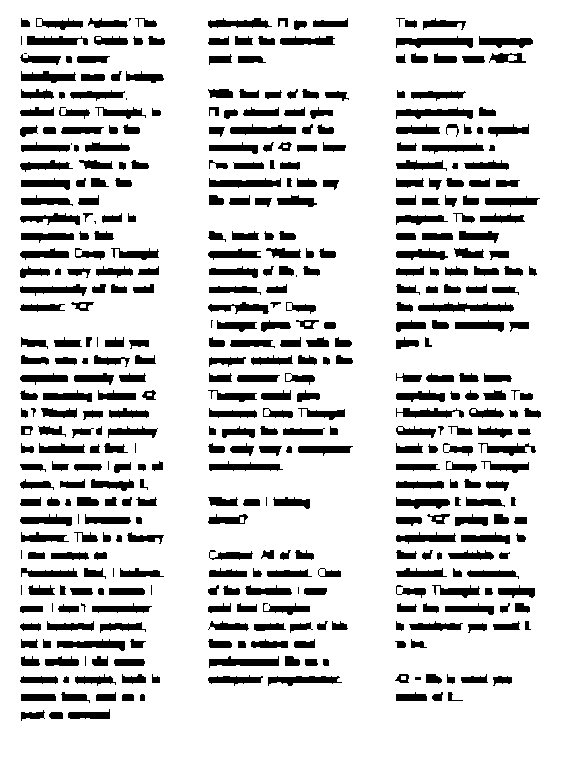
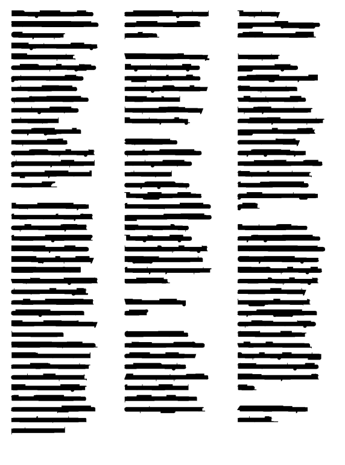
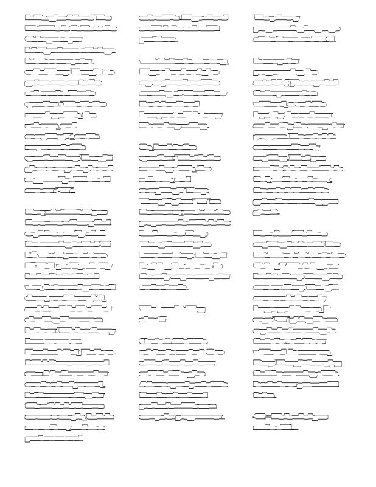

## UFS -  UNIVERSIDADE FEDERAL DE SERGIPE

#### CCET - CENTRO DE CIÊNCIAS EXATAS E TECNOLOGIA

#### DCOMP - DEPARTAMENTO DE COMPUTAÇÃO

-----------------------------

## Disciplina: Processamento de Imagens
## Professora: Beatriz Trinchão Andrade
## Alunos: Jocelino Alves Pereira Neto e Lucas Brabec Barreto Santana

### 1. Introdução

Para entender melhor o problema, daremos uma breve introdução do que é OCR, ou **Optical Character Recognition** (Reconhecimento Óptico de Caracteres) é uma ferramenta que auxilia na verificação e identificação de dados em documentos. Em outras palavras, é o processo que lê uma imagem que contém texto e faz o reconhecimento de cada caractere, já que o computador não compreende outra linguagem além da binária.

Na primeira etapa do projeto, foi proposto a implementação de algoritmos de filtro para remoção do tipo Sal e Pimenta, que foram realizadas com socesso. Nesta segunda etapa foi proposto a implementação de um pré-OCR.

O pré-processador OCR implementado neste projeto servirá para identificação de quantidade de palavras, linhas e colunas presente no texto contido na imagem passada que servirá para a renomeação da imagem final do projeto. ~~Além disso, a imagem final conterá cada palavra do texto circunscrita por um retângulo.~~

Para a implementação do projeto foram utilizados Processamentos Morfológicos de Dilatação, Erosão e Extração de Componentes Conexos e Extração de Fronteiras.

Para entender melhor:
> Lê-se A como imagem de entrada e B como Elemento Estruturante (ES).

 - Processamentos morfologicos são ferramentas de extrair componentes de imagens que serão úteis na representação e descrição de formas em certas regiçoes da imagem.

 - Dilatação é a operação que, operada em A por B resulta em pixels que possui a sobreposição de ao menos um pixel na região analisada com o ES. Essa operação pode ser representada por:

  

 - Erosão é a operação que, operada em A por B resulta em pixels que possui a sobreposição de todo pixel na região analisada com o ES. Essa operação pode ser representada por:

  

 - Extração de Componentes Conexos: seja A um conjunto contendo um ou mais componentes conexos, formando um arranjo matricial X_0, os elementos que não são valores de fundo indicarão indices para auxiliar na contagem e separação dos objetos. Essa operação pode ser representada por:

  

 - Extração de Fronteiras é a operação que permite a extração das fronteiras, ou em outras palavras destacar as bordas dos objetos na imagem. Essa operação é representata por:

  

 Para executar o código será utilizado o [Google Collab](https://drive.google.com/drive/folders/1U_txcDoEo0fCZp33XYn_e8rGf19e72c3?usp=sharing). Em caso de problema com o link, é possível copiar e colar no navegador: [https://drive.google.com/drive/folders/1U_txcDoEo0fCZp33XYn_e8rGf19e72c3?usp=sharing](https://drive.google.com/drive/folders/1U_txcDoEo0fCZp33XYn_e8rGf19e72c3?usp=sharing)

----------------------------------

### 2. Definição do Problema

Nesta primeira etapa do projeto devemos ler uma imagem no formato PBM que contém somente textos com a fonte Arial e o tamanho da fonte não variante.

As imagens utilizadas como teste são o resultado da primeira etapa do projeto.

----------------------------------

### 3. Projeto e implementação da solução

Para a implementação do projeto foram utilizados Processamentos Morfológicos de Dilatação, Erosão e Extração de Componentes Conexos e Extração de Fronteiras.

A seguir será detalhado o que foi utilizado em cada operação:

- Dilatação
  Utilizando laços para iterar em cada coordenada da imagem de origem e aplicando translação, e logo em seguida pegando o valor máximo no intervalo avaliado. Assim, caso exista ao menos um valor 1 no intervalo ele será aplicado.

- Erosão
  Parecido com a operação de dilatação, esta irá apenas atribuir o valor 1 na posição quando todos os pontos preenchidos casarem. Assim, como no caso anterior ele pega o valor máximo, aqui ele pega o mínimo.

- Extração de Componentes Conexos
  Utilizando as noções do vídeo usado como referência, a operação é consistida por uma varredura pela imagem, verificando o valor maximo presente no intervalo do kernel, e quando na imagem original tiver valor 1 (um) e todos os vizinhos forem imagem de fundo o valor aplicado será um valor se um contador de equivalencia, que quando a posição ancora for uma imagem de frente na original o contador é incrementado. Quando existem 2 ou mais valores já atribuídos é calculado o valor mínimo no intervalo e substitui todas as ocorrências onde eram o valor maior pelo menor.

- Contagem de ocorrências
  Utilizando as ocorrências anteriores, cada contagem é realizada utilizando operações de dilatação e erosão e aplicando a contagem será utilizando a Extração de Componentes.

 
  *Contagem de linhas:*

  > Para calcular as linhas utilizamos três operações de fechamento,
  > duas para cada um dos eixos da imagem original e uma final para 
  > a mescla de pixels horizontais e verticais, com a seguinte
  > configuração:
  >  1. Para o filtro horizontal utilizamos um ES com dimensão (5,1)
  >  2. Para o filtro vertical, utilizamos um ES com dimensão (1,60)
  >  3. E finalmente, a última operação de fechamento com um ES de dimensão (5,60)

  >  Após a aplicação dessas operações morfológicas, realizamos a extração de componentes conexos da função raster_scan nos pixels da mescla dos eixos.

*Contagem de Palavras:*

> Equivalente a operação anterior, temos três operações de fechamento,
> duas para cada um dos eixos da imagem original e uma final para a mescla
> de pixels horizontais e verticais, com a seguinte configuração:
>    1. Para o filtro horizontal utilizamos um ES com dimensão (8,1)
>    2. Para o filtro vertical, utilizamos um ES com dimensão (1,10)
>    3. E finalmente, a última operação de fechamento com um ES de dimensão (8,10)
> Após a aplicação dessas operações morfológicas, realizamos a extração de
>  componentes conexos da função raster_scan nos pixels da mescla dos eixos.

- Extração de Fronteiras
Essa operação não foi completa, pois os valores e formados da ES não foram encontrados para enclausurar as palavras e aplicar a circunscrição na imagem original.

Após conseguir o mapa de pixel, salvamos o resultado em outro arquivo contendo o nome do grupo e a quantidade de linhas e palavras, que foram contadas manualmente.

----------------------------------

### 4. Resultados Obtidos

Após aplicar os filtros de mediana, obtivemos os seguintes resultados:

| Imagem identificação palavras | Imagem identificação linhas | Imagem identificação bordas |
| ---------------- | --------------------------- | --------------------------- |
|   |   |   |

----------------------------------

### 5. Conclusão

Após aplicação das etapas presentes no código disponível no [Google Collab](https://drive.google.com/drive/folders/1U_txcDoEo0fCZp33XYn_e8rGf19e72c3?usp=sharing) é possível perceber que a contagem de palavras, linhas e colunas é bastante satisfatória. Utilizando a amostragem das imagens de exemplo foi percebido que a contagem tem média de acerto de mais de 80%. Pois em alguns casos ainda se tornou dificultoso identificar certas caracteristicas de caracteres menores.

### Referências:

 - https://www.youtube.com/watch?v=ticZclUYy88

 - https://medium.com/hackernoon/an-introduction-to-morphological-operations-for-digital-image-text-classification-79cb14bab2d7
